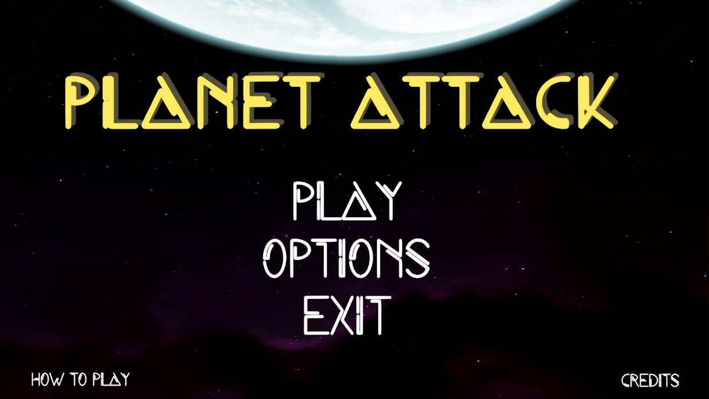
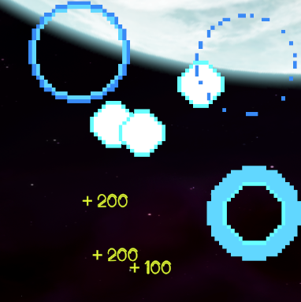
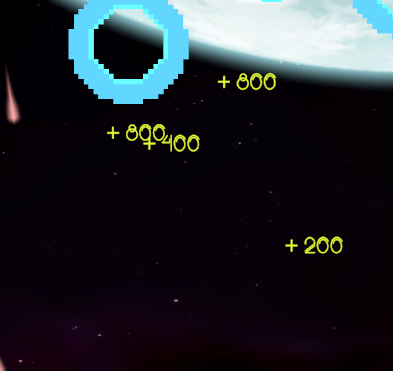
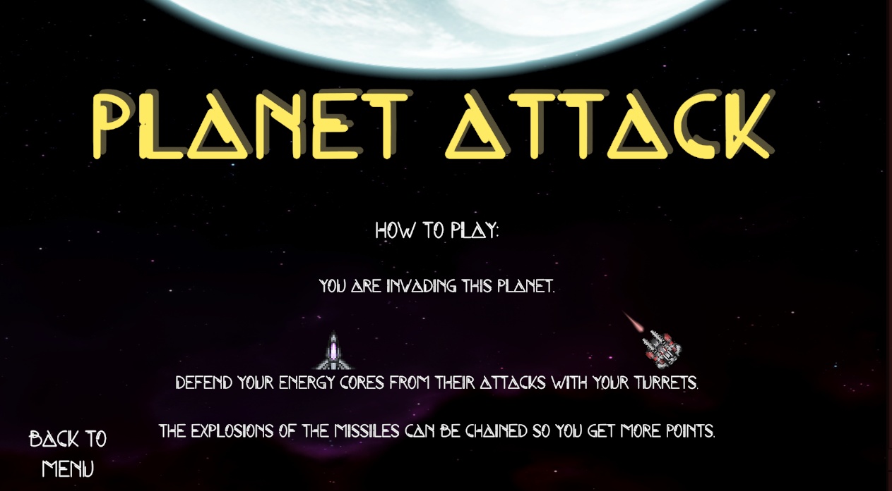
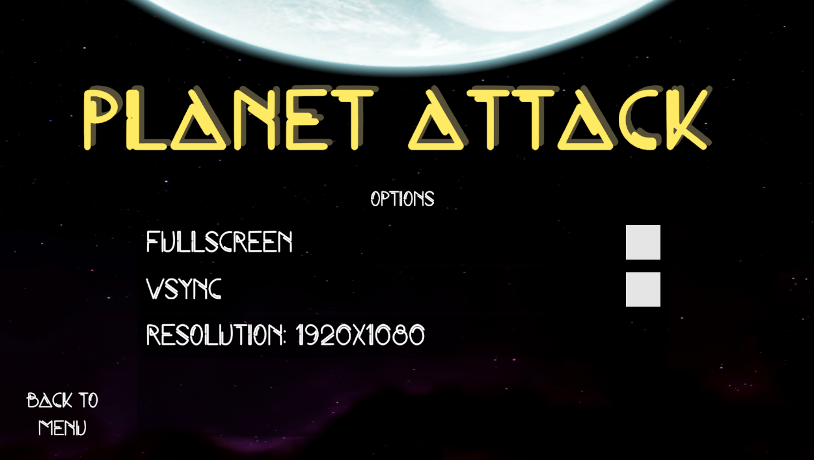
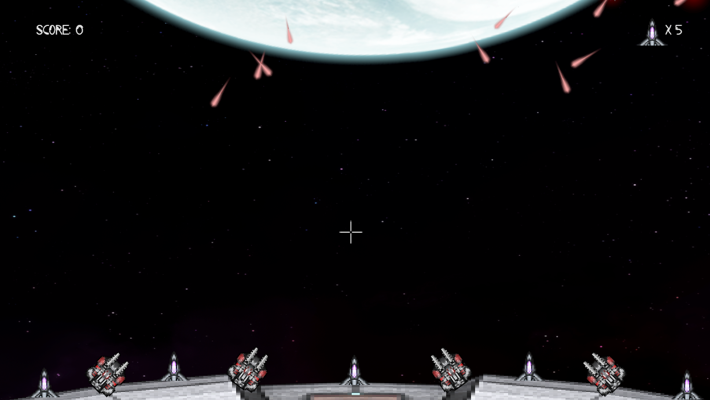

# PR - Planet Attack

## Descripción

Una adaptación del clásico juego "Missile Command" de la Atari, lanzado el 1980.

Se ha intentado mantener el game feeling y la idea original.

## Cómo jugar

El juego se controla con el ratón.

- Movimiento del ratón: Apuntar con la retícula
- Botón izquierdo del ratón : Disparar

Deberemos proteger nuestros nodos de energía del fuego enemigo.Para ello debemos disparar a los misiles que se dirigen hacia ellos. 

Las explosiones generan una onda expansiva que destruirá cualquier otro proyectil que venga a continuación, lo cual a su vez generará más puntos.

## Capturas de pantalla y vídeo

- Como jugar

- Opciones

- Partida

Video: https://youtu.be/_mumUIwUZL8

## Implementación
Para poder adaptar la lógica del juego se han utilizado las clases siguientes:

### Clase AnimationAutoDestroy
Clase que utilizamos para que las explosiones desaparezcan tras acabar su animación.
De no hacerse así y eliminarlas directamente, queda bastante mal.

### Clase BackgroundScroller
Clase que se utiliza para que el fondo sea dinámico, tanto el planeta rotando como el background en movimiento.
Mejora bastante la presentación.

### Clase EnemySpawnController
Clase que controla la aparición e instanciación de los misiles enemigos en base a un ratio de aparición.
Fija el origen y destino de cada misil para que sean aleatorios.

### Clase ExplosionController
Clase para controlar la vida de las explosiones generadas por los disparos del jugador con su consecuente actualización de puntuación para el jugador. 
Se usa para poder sumar los puntos correctos al poder enlazarse explosiones y duplicarse los puntos obtenidos por las mismas.
Además, genera una indicación con los puntos obtenidos en el onDestroy de la explosión. 

### Clase GameController
Clase para gestionar el fin de la partida así como la vuelta al menú principal.

### Clase MenuController
Clase que se encarga de las transiciones en el menú principal para mostrar sus distintas secciones (opciones, como jugar y créditos).

### Clase PlayerControler
Clase que gestiona la lógica referente a los disparos del jugador y movimiento de las torretas que los realizan.

### Clase PointsPopUpController
Clase muy simple que se encarga de mostrar el valor correcto de los diálogos con los puntos generados en cada explosión

### Clase ProjectileController
 Clase que se encarga de la lógica de los proyectiles. Tanto de colisiones, como de la vida del objeto, como de generar las explosiones al detonarse el proyectil.

### Clase ScoreController
Clase que se encarga de mostrar en la UI el valor de puntos actual y la vida.

### Clase TurretController
 Clase que gestiona la rotación de las torretas.

 El jugador dispara con 4 torretas, las cuales se gestionan de manera que dispara la que más cerca al objetivo se encuentre. Las torretas solo giran 45 grados para cada lado, y así crear angulos a los que no puede llegar el jugador, haciendo que tenga que preveer estos casos y ser proactivo.

 ### Clase AudioController
 Clase para gestionar el cambio de música en la escena del juego.

## Desarrolladores

 - Francisco José Palacios Márquez

## Recursos de terceros

Sprites/Background - https://assetstore.unity.com/packages/2d/environments/2d-space-kit-27662

Lógica para gestión de opciones - https://assetstore.unity.com/packages/tools/utilities/qasic-198122

Visual effects / Musica - https://assetstore.unity.com/packages/2d/textures-materials/abstract/warped-shooting-fx-195246

Fuente del texto - https://www.fontspace.com/space-game-font-f71162

Efectos de sonido - https://assetstore.unity.com/packages/audio/sound-fx/space-sfx-102218-131463

Música - https://assetstore.unity.com/packages/audio/music/space-threat-free-action-music-205935